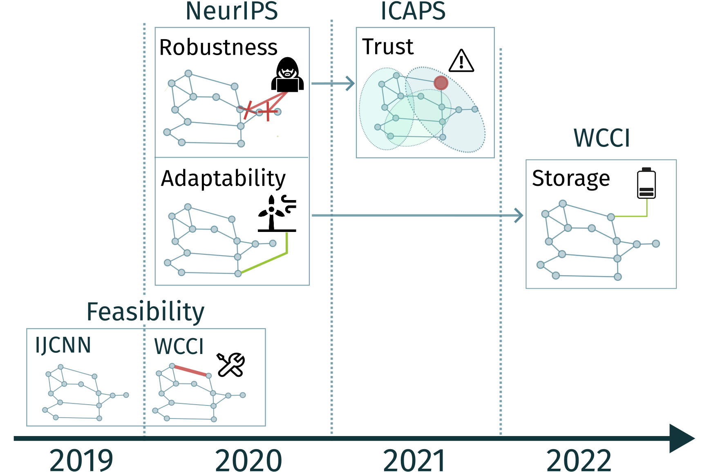
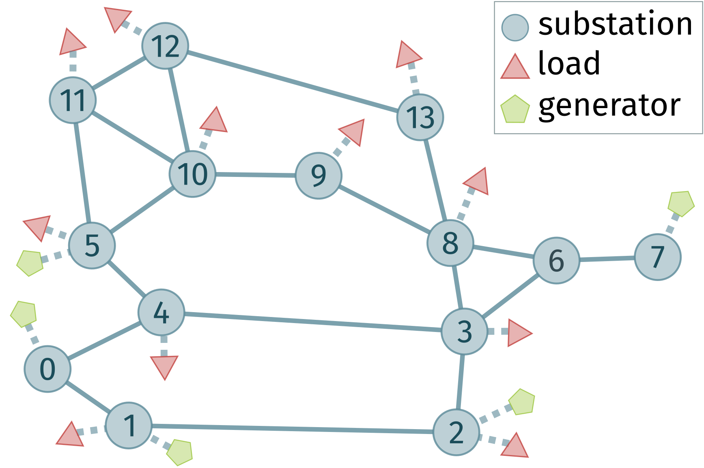
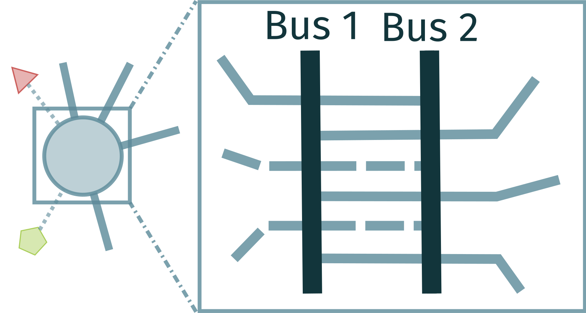
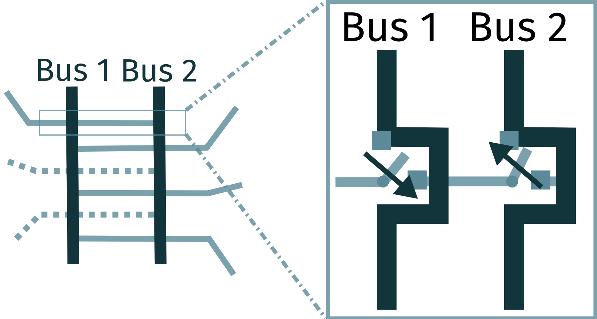
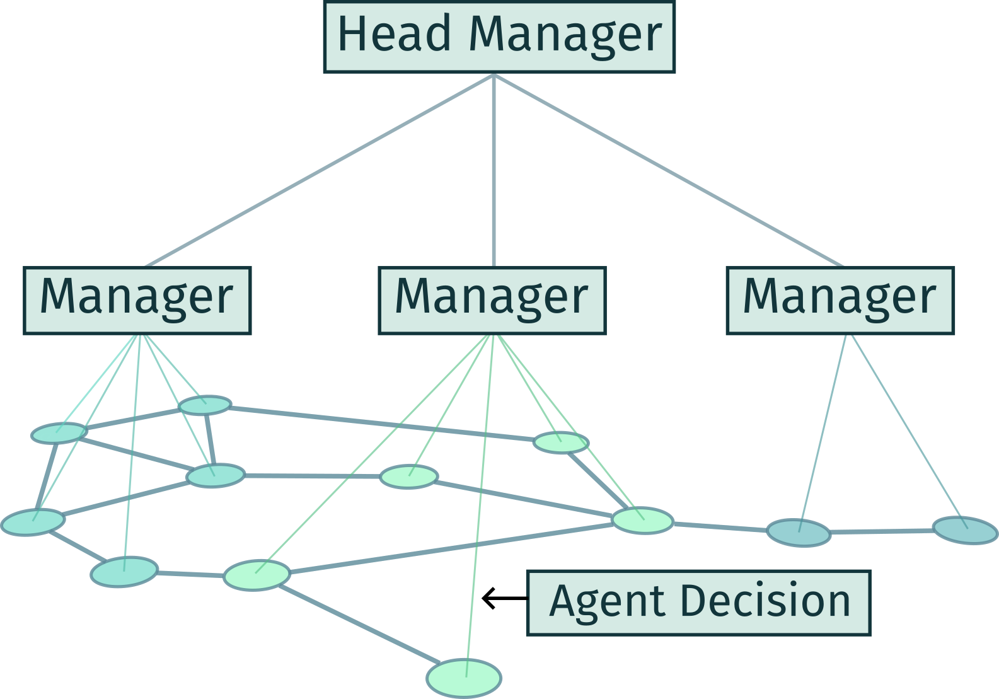

# Table of Contents

1.  [Introduction](#org78e4d6c)
2.  [Problem Description](#org09277c3)
3.  [System Description](#orged2481f)
4.  [Installation](#orgac677f4)
5.  [Execution](#orgf3086ca)

# Introduction
[Thesis](https://www.politesi.polimi.it/retrieve/42d6db27-0396-4cd4-8373-1f6e34da5bef/Tesi_L2RPN.pdf)

We are in the middle of a climate crisis, renewable energies must readily be implemented in the power grids. However, solar and wind power integration in the grid is challenging, their production depends on the weather, and our overall storage capacity is insufficient. We hope artificial intelligence (AI) can assist grid operators.

For this reason, RTE (Réeseau de Transport d&rsquo;Electricité) has been organizing the **Learning to Run a Power Network (L2RPN)** challenge to foster AI applications to power network control, see below for a timeline of the competitions:

    

L2RPN challenges cast the power network control problem in the Reinforcement Learning (RL) framework. The actions allowed to the autonomous agent are akin to those available to a human operator (e.g. line switching and power production changes). The control problem ends when the total demand is not met anymore, i.e., a blackout is triggered.

Challenges offer standardized and reproducible benchmarks that alleviate the AI reproducibility crisis. However, scientific competitions force participants to build instance-optimized solutions with limited real-world applicability. We developed a model to solve the challenge independently of any competition and used the L2RPN testbed for evaluation.

We developed a hierarchical Multi-Agent RL (MARL) system:

-   **Multi-Agent**: multiple agents participate in each decision;
-   **Hierarchical**: managers handle communities of agents and select the best decision proposed by each community.

# Problem Description

    

The L2RPN challenge is a series of competitions that model the sequential decision-makig environments of real-time power network operation. The participants&rsquo; algorithms must control a simulated power network within an RL framework.
RTE has developed Grid2Op, a python module that casts the power grid operational decision process into a Markov Decision Process (MDP). Grid2Op represents a power grid as a set of objects: powerlines, loads, and generators, with substations linking everything together. **Powerlines connect substations and allow power to flow from one place to another**.

However, our power network model needs to take into account also the **internal structure of substations**, where we find two busbars to which every grid object connects.
Substations connect elements through switches which allow the operator to electrically separate elements from each other.
Below we see the buses inside of a substation (on the left) and the switches inside a bus (on the right).

   
  

# System Description

    

We developed a **hierarchical multi-agent RL system**. The system has three main actors: substation agents, community managers, and head managers.

**Every substation houses an agent** which perceives only its immediate neighborhood, i.e., the directly connected powerlines and substations. Each agent takes one action per timestep given its current immediate neighborhood and experiences. Every substation agent may handle any number of buses. In the Grid2Op model, each substation houses two buses.

The system then builds agent communities: subgraphs composed by reducing the number of outgoing edges and maximizing inner edges. We detect communities dynamically through Dynamo, an extension of the Louvain algorithm to dynamic networks. **Each community manager handles a community of agents**. Each manager selects an agent belonging to the community, given the community structure, all the current agents&rsquo; actions, and their experience.

Finally, **the head manager receives all the managers&rsquo; choices and must choose one**. Then, the action of the chosen agent gets executed. The head manager picks a manager given a summarized version of the graph where communities are represented as nodes linked by inter-community edges. Like all other system actors, the head manager is an RL agent, thus pairing its current perception with experience to make a decision.

# Installation

Clone the project

    git clone https://github.com/DPaletti/pop

Install all the dependencies (you will need to [install poetry](https://python-poetry.org/docs/#installation) first).
If you want to install the dependencies manually you can inspect the `pyproject.toml` file.

    poetry install

# Execution

Run files specify all the required hyperparameters of a system run.
For example, to train the base architecture we run the following

    poetry run pop/main --run-file ./runs/run_files/dpop_base.toml

